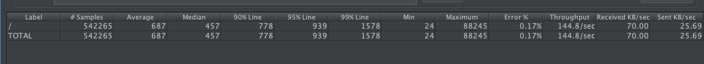

## What is ``watch_logs``

1. ``watch_logs`` is a standalone CLI which can tail any console or API request and logs.
2. You can configure ``watch_logs`` to send a notification whenever a regexp match is found on a tailed log file.
3. ``watch_logs`` supports sending alert notifications to MS teams and via Email. For more info, see [go-alertnotification](https://github.com/rakutentech/go-alertnotification).
4. ``watch_logs`` has an inbuilt throttler counter which allows you to set a limit to num of alert messages for a regexp within the duration.

### Install using go

```bash
export GO111MODULE=on
go get github.com/rakutentech/go-watch-logs/cmd/watch_logs
watch_logs --help
```

### Or Install using executable

Use this method if go is not installed on your server

```bash
git clone https://github.com/rakutentech/go-watch-logs/
./bin/linux/watch_logs --help
```

## Run

```bash
cp .env.example .env
set -a && . ./.env && set +a
watch_logs --watch-file=/path/to/logs.log "regexp1" "regexp2" > /dev/null 2>&1 &
```

## Run it on a cron

``watch_logs`` shouldn't kill itself even when the watching file is removed. It is capable of recovering itself.
But it is good idea to add it to your cronjob.

```
* * * * * set -a && . /path/to/.env && set +a && flock -n /tmp/watch_logs.lock watch_logs --watch-file=/path/to/logs.log "regexp1" "regexp2" > /dev/null 2>&1 &
```


**All done!**

## Help

```
--help
        Prints this Usage
--limit int
        Limit to notify (default 10)
--seconds int
        Limit notify per number of second (default 30)
--watch-file string
        Path to the file to tail
-recovery-cmd string
        Shell cmd to execute on match found (default "")

Basic Usage:
        watch_logs --limit=10 --seconds=30 --watch-file=/path/to/your.log  "regexp1" "regexp2"
Description:
        Will send max 10 notifications every 30 seconds for regexp1 matched per line in your.log file
        And will send max 10 notifications every 30 seconds for regexp2 matched per line in your.log file
```

## Build it your self

```sh
GOOS=linux GOARCH=amd64 go build cmd/watch_logs.go; mv watch_logs ./bin/linux/
GOOS=darwin GOARCH=amd64 go build cmd/watch_logs.go; mv watch_logs ./bin/mac/
```

----

## Performance Notes

1. Load on http server



2. ``watch_logs`` on the ``ssl_access_log`` for ``HTTP/1.1" 50`` errors.

```
watch_logs --limit=2 --seconds=60 --watch-file=/var/log/httpd/vhost/ssl_access_log "HTTP/1.1\" 50"
```

3. ``watch_logs`` doesn't consume much memory.

Check the RSS is the Resident Set Size and which is used to show how much memory is allocated to that process and is in RAM. VSZ is the Virtual Memory Size. It includes all memory that the process can access

> Total memory used through out is **12720 KB** i.e. **12 MB**

```s
Address           Kbytes     RSS   Dirty Mode  Mapping
total kB          709040   12720    6552
```

> Viewing httpd app and ``watch_logs`` pids with top command

```s
PID    USER      PR  NI    VIRT    RES    SHR S  %CPU %MEM   TIME+ COMMAND
108778 appuser+  20   0  375916  10340   4864 S   1.0  0.3   0:18.91 main
108770 appuser+  20   0  375916  10352   4884 S   1.0  0.3   0:18.88 main
125938 appuser+  20   0  496132   2600   1884 S   0.0  0.1   0:00.99 start_server
125902 appuser+  20   0  496132   8008   1620 S   0.0  0.2   0:01.17 start_server
 23545 appuser+  20   0  709036  12340   3920 S   0.0  0.3   0:01.65 watch_logs
 45145 apache    20   0  142776   3052    640 S   0.0  0.1   0:09.71 httpd
 99944 root      20   0  142776   6944   4544 S   0.0  0.2   0:15.16 httpd
```

## Credits

1. https://github.com/rakutentech/go-alertnotification
2. https://github.com/hpcloud/tail

